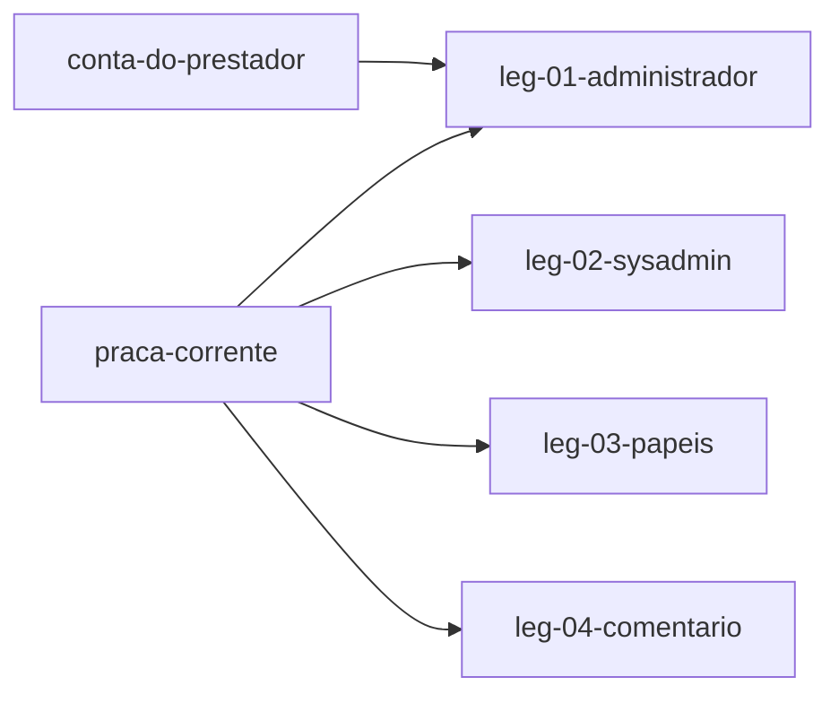

# Swimlane · administracao

lane-meta: thread=no · risk=med · owner=produto

FORK: B (task-driven) - o backlog inteiro desce para Task-Specs assinados no Pass 5; nao ha caminho plan-driven neste programa.

Component **D · Administracao** - as superficies de quem opera: o Administrador da praca e o SysAdmin da plataforma, que hoje caem os dois numa home generica que nao serve para nenhum.
Input contract: `praca-corrente` (raia praca) + `conta-do-prestador` (raia comissao).
Output contract: nenhum - esta raia e terminal. Ela **consome** contratos e nao publica nenhum.

> **PRD da raia - indice enxuto sobre os legs.** Detalhe no arquivo de cada leg.

## Seam

Esta raia e o consumidor puro do sistema: le os contratos das outras duas e nao
produz nada que alguem consuma. Por isso a costura e so de entrada, e a
dependencia e trivialmente de mao unica.

O corte se justifica porque o **consumidor e diferente**: Administrador e
SysAdmin decidem coisas que nenhum outro papel decide, e as telas deles nao
compartilham nem dado nem regra com as do prestador ou do cliente.

O segredo desta raia: **o que conta como informacao operacional util** para quem
opera. E a decisao mais provavel de mudar depois do primeiro uso real, e por isso
fica escondida aqui e nao vaza para os contratos.

## Architecture



Step-by-step:

1. `leg-01` da ao Administrador uma tela do que ele decide na praca dele.
2. `leg-02` da ao SysAdmin uma tela do que ele decide na plataforma inteira.
3. `leg-03` deixa o Administrador criar papeis alem de funcionario.
4. `leg-04` faz o comentario marcado como publico chegar a quem e do servico.

## Non-Goals

- **Nao** exibe o cartao de boas-vindas em nenhuma das duas telas - R-7 e
  explicito, e o dono confirmou ao vivo que Hero e para Cliente e Prestador.
- **Nao** confirma pagamento aqui: a fila de pendencias e da raia `comissao`;
  esta raia so linka para ela.
- **Nao** resolve o Hero considerado feio (GAP-002) - falta direcao de design.

## Legs — index (full detail in each file)

| Leg | Responsibility (one line) | File |
|---|---|---|
| **leg-01-administrador** | Dar ao Administrador uma tela do que ele decide na praca dele | [leg-01-administrador.md](leg-01-administrador.md) |
| **leg-02-sysadmin** | Dar ao SysAdmin uma tela do que ele decide na plataforma inteira | [leg-02-sysadmin.md](leg-02-sysadmin.md) |
| **leg-03-papeis** | Deixar o Administrador criar papeis alem de funcionario, com modulos na criacao | [leg-03-papeis.md](leg-03-papeis.md) |
| **leg-04-comentario** | Fazer o comentario marcado como publico chegar ao cliente e ao prestador | [leg-04-comentario.md](leg-04-comentario.md) |

Stable keys: `swimlane-administracao-leg-01..04`.

## Dependencies

```
praca-corrente     -> leg-01, leg-02, leg-03, leg-04
conta-do-prestador -> leg-01
```

## Build order

1. **leg-01** - o Administrador e quem opera a praca; sem tela dele a comissao
   nao tem quem confirme na pratica.
2. **leg-02** - SysAdmin depois: ele ja enxerga tudo por outros caminhos.
3. **leg-04** - pequeno, e a permissao ja existe; falta so exibir.
4. **leg-03** - `should`, e o mais caro dos quatro.

## Open questions

| # | Item | Owner | Blocks build? |
|---|---|---|---|
| Q1 | Quais indicadores exatamente cada painel abre? Assumido: Administrador ve pendencias de pagamento, prestadores aguardando aprovacao, agenda da praca e faturamento; SysAdmin ve as pracas, o total por praca e os logs de admin. | eu (decidido) | Nao |
| Q2 | ROADMAP §4 pede modulos habilitaveis por papel customizado; a lista final de modulos nunca foi fechada. | Leonardo Chalhoub | Sim, para `leg-03` apenas |

## Spec traceability

- **R-6, R-7** - `leg-01` e `leg-02` tiram os dois papeis da home generica.
- **R-8** - `leg-01` (agenda completa da praca).
- **R-30** - `leg-03`.
- **R-25** - `leg-04`.
- **ADR 0002** - as duas telas nascem depois do escopo de leitura, nunca antes,
  senao nascem vazando.

## Seam evolution (H4) - os contratos que esta raia consome

Consome `praca-corrente` e `conta-do-prestador`. Mudancas **aditivas** nos dois
sao seguras: um painel que ignora um campo novo continua correto.

Mudancas **quebradoras** - remover um estado de conta, mudar o significado de
praca-corrente - exigem janela de convivencia, porque um painel que soma errado e
pior que um painel que nao existe: ele parece certo.

Recomendacao: os totais de cada painel devem ser deriváveis dos mesmos contratos
que a raia de origem publica, nunca de leitura direta abaixo da costura - assim
uma mudanca upstream aparece como numero divergente no teste de contrato, e nao
como um painel silenciosamente errado.
