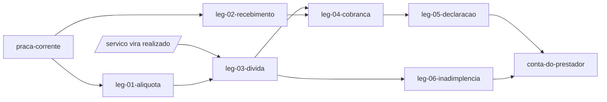

# Swimlane · comissao

lane-meta: thread=no · risk=high · owner=plataforma

FORK: B (task-driven) - o backlog inteiro desce para Task-Specs assinados no Pass 5; nao ha caminho plan-driven neste programa.

Component **C · Comissao** - a raia que faz a plataforma receber: define quanto cada servico deve, gera a divida no instante certo, cobra, registra o pagamento declarado e escala a inadimplencia.
Input contract: `praca-corrente` (a praca e sua aliquota geral) + o servico que virou `realizado`.
Output contract: **`conta-do-prestador`** - o saldo devedor de um prestador e o estado da conta dele: em dia, pendente ou suspensa.

> **PRD da raia - indice enxuto sobre os legs.** Detalhe de cada leg no arquivo
> dele (`leg-NN-<tech>.md`, chave `swimlane-comissao-leg-NN`).

## Seam

A costura publica **um predicado e um numero**: `conta-do-prestador`. Quem
consome nao precisa saber como a aliquota foi resolvida entre quatro niveis, nem
como a divida foi calculada, nem quantos avisos ja sairam - so o saldo e o
estado.

Dependencia de mao unica: `prestador` e `administracao` **leem** esse contrato;
nenhuma delas escreve nele. A raia `comissao` nunca le de volta o estado de
aprovacao - se lesse, haveria ciclo com `prestador` (ver H5 no PRD daquela raia).

O segredo desta raia: **a resolucao de aliquota**. Quatro niveis de precedencia
sao a parte mais provavel de mudar - e por isso ficam inteiramente aqui dentro.

## Architecture



Step-by-step:

1. `leg-01` responde "quanto por cento" para um servico qualquer, resolvendo os 4 niveis.
2. `leg-02` responde "para onde vai o dinheiro" no nivel da praca.
3. `leg-03` transforma servico realizado em divida, usando o valor final.
4. `leg-04` transforma divida do dia em cobranca com codigo legivel.
5. `leg-05` registra a declaracao do prestador e a decisao do Administrador.
6. `leg-06` escala o atraso ate a suspensao; o contrato publicado carrega o estado.

## Non-Goals

- **Nao** concilia pagamento automaticamente (W-2) - toda confirmacao e humana.
- **Nao** cobra o cliente: a cobranca cliente-prestador ja existe e e outra coisa.
- **Nao** gera estorno: a divida nasce em `realizado`, entao cancelamento anterior
  nao produz divida nenhuma (ADR 0005).
- **Nao** decide se o prestador aparece na busca - publica o estado; quem decide
  aparicao e a raia `prestador`.

## Legs — index (full detail in each file)

| Leg | Responsibility (one line) | File |
|---|---|---|
| **leg-01-aliquota** | Responder quanto por cento um servico deve, resolvendo 4 niveis de precedencia | [leg-01-aliquota.md](leg-01-aliquota.md) |
| **leg-02-recebimento** | Dar a praca um lugar de recebimento que nao seja PII de pessoa fisica | [leg-02-recebimento.md](leg-02-recebimento.md) |
| **leg-03-divida** | Transformar servico realizado em divida sobre o valor final | [leg-03-divida.md](leg-03-divida.md) |
| **leg-04-cobranca** | Transformar a divida do dia numa cobranca com codigo legivel | [leg-04-cobranca.md](leg-04-cobranca.md) |
| **leg-05-declaracao** | Registrar a declaracao do prestador e a decisao do Administrador | [leg-05-declaracao.md](leg-05-declaracao.md) |
| **leg-06-inadimplencia** | Escalar o atraso em 3 dias ate a suspensao, com canal de saida | [leg-06-inadimplencia.md](leg-06-inadimplencia.md) |

Stable keys: `swimlane-comissao-leg-01..06`.

## Dependencies

```
praca-corrente -> leg-01 -> leg-03 -> leg-04 -> leg-05 -> conta-do-prestador
praca-corrente -> leg-02 -> leg-04
                          leg-03 -> leg-06 -> conta-do-prestador
```

## Build order

1. **leg-01** - sem resolver aliquota nao ha divida; e o insumo de tudo.
2. **leg-03** - a divida e o objeto central; vem antes de qualquer tela.
3. **leg-02** - o recebimento so importa quando ha o que cobrar.
4. **leg-04** - a cobranca depende do risco tecnico ja resolvido em
   `swimlane-jornada-leg-01` (legibilidade do codigo com dados no centro).
5. **leg-05** - fecha o ciclo do dinheiro.
6. **leg-06** - a consequencia; ultima porque so faz sentido com divida existindo.

## Open questions

| # | Item | Owner | Blocks build? |
|---|---|---|---|
| Q1 | GAP-001 do spec: a divida acumula entre dias? Assumido que sim, com a contagem de 3 dias partindo da pendencia mais antiga. | Leonardo Chalhoub | Nao - o padrao assumido e implementavel e reversivel |
| Q2 | O nivel "por categoria" depende de o servico carregar categoria, que hoje nao carrega (ADR 0004). Criar a categoria no servico e parte desta raia ou vira pre-requisito? | eu (decidido) | Nao - resolvido em `leg-01`: a categoria entra no servico dentro deste leg |
| Q3 | Quem recebe o aviso por e-mail quando a praca ainda nao tem chave de recebimento (R-12 diz que ela nao emite cobranca)? | Leonardo Chalhoub | Nao - o caminho degradado e "nao emite e avisa na tela" |

## Spec traceability

- **R-9, R-10** - `leg-01` (precedencia de 4 niveis, so admin/sysadmin alteram).
- **R-12** - `leg-02`, sobre o vazio registrado no ADR 0006.
- **R-11** - `leg-03`, sobre o instante fixado no ADR 0005.
- **R-13, R-14, R-15** - `leg-04`.
- **R-16, R-17** - `leg-05`.
- **R-18, R-19, R-20** - `leg-06`.
- **ADR 0004** - a categoria nao existe no servico; `leg-01` trata isso como
  pre-condicao explicita, nao como detalhe.
- **ADR 0005** - "valor final" e o valor no instante em que o status vira realizado.
- **ADR 0006** - a chave pessoal nao serve como chave da praca.
