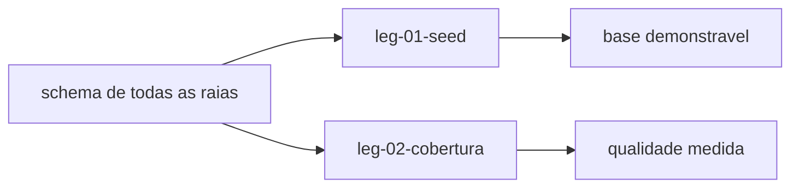

# Swimlane · dados

lane-meta: thread=no · risk=med · owner=plataforma

Component **F · Dados** - a base de demonstracao e a prova de qualidade: sem dado plausivel nenhuma tela nova convence, e sem medicao a meta de cobertura e so uma intencao.
Input contract: o schema final de todas as raias.
Output contract: nenhum - raia terminal.

> **PRD da raia - indice enxuto sobre os legs.**

## Seam

Esta raia e a ultima de todas porque **consome o schema de todas**: para semear
uma divida e preciso que divida exista; para semear uma praca e preciso que praca
exista. A dependencia e de mao unica e total.

O corte se justifica porque o trabalho aqui e de natureza diferente: nao e
comportamento de produto, e **evidencia** - dado que torna o produto
demonstravel, e numero que torna a qualidade auditavel.

O segredo desta raia: **o que faz um dado parecer real**. E a decisao mais
provavel de mudar quando alguem olhar a tela e disser "ainda parece falso".

## Architecture



Step-by-step:

1. `leg-01` repovoa a base com historico denso e plausivel, ate dezembro de 2026.
2. `leg-02` mede as duas coberturas e liga os 22 testes de permissao desligados.

## Non-Goals

- **Nao** inventa dado de pessoa real: tudo e ficticio, como ja e hoje.
- **Nao** trava o gate de cobertura em 100% agora - a meta e registrada, a trava
  entra quando o numero estiver perto (ver R-33/R-34).
- **Nao** refaz a faxina de linguagem da v1: isso e `swimlane-jornada-leg-04`.

## Legs — index (full detail in each file)

| Leg | Responsibility (one line) | File |
|---|---|---|
| **leg-01-seed** | Repovoar a base com historico denso e plausivel ate dezembro de 2026 | [leg-01-seed.md](leg-01-seed.md) |
| **leg-02-cobertura** | Medir as duas coberturas e ligar os 22 testes de permissao desligados | [leg-02-cobertura.md](leg-02-cobertura.md) |

Stable keys: `swimlane-dados-leg-01..02`.

## Dependencies

```
schema de todas as raias -> leg-01
schema de todas as raias -> leg-02
```

## Build order

1. **leg-02** - a cobertura pode comecar cedo: os 22 testes de permissao ja
   existem escritos e provam justamente a fronteira que a raia praca cria.
2. **leg-01** - por ultimo de tudo: so faz sentido semear o schema final.

## Open questions

| # | Item | Owner | Blocks build? |
|---|---|---|---|
| Q1 | Quantos prestadores e clientes por praca tornam a demonstracao convincente? Assumido: pelo menos 2 pracas, 6 prestadores e 20 clientes, com densidade de ~8 horarios por prestador por mes. | eu (decidido) | Nao |
| Q2 | GAP-006 do spec: a meta de 100% de cobertura tem prazo? | Leonardo Chalhoub | Nao |

## Spec traceability

- **R-26, R-27** - `leg-01`, sobre o defeito medido no ADR 0007 (densidade e fim
  do ano, nao amplitude).
- **R-33, R-34, R-35, R-36** - `leg-02`.
- **ADR 0007** - o historico ja tem 35,3 meses; o trabalho e densidade.

## Seam evolution (H4) - o contrato que esta raia consome

Consome o schema de todas as raias. Toda mudanca de schema e, para esta raia,
potencialmente **quebradora**: um campo obrigatorio novo invalida o semeador
inteiro.

Recomendacao: o semeador roda no fim de cada raia que muda schema, e nao so no
fim do programa - assim a quebra aparece na raia que a causou, e nao acumulada
aqui no ultimo dia.
