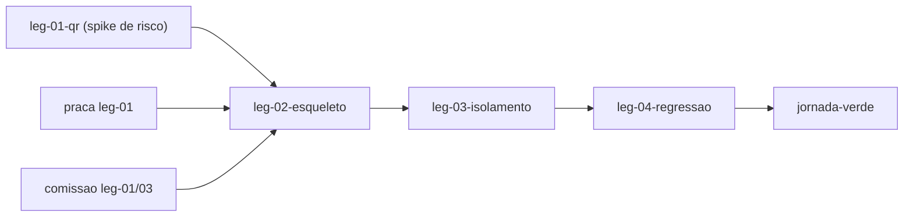

# Swimlane · jornada

lane-meta: thread=yes · risk=high · owner=plataforma

Component **E · Jornada** - o esqueleto que anda: o caminho vertical mais fino que atravessa **todas** as costuras de ponta a ponta, construido e provado **antes** de qualquer raia engordar.
Input contract: a versao minima do que cada raia publica.
Output contract: **`jornada-verde`** - a prova executavel de que as costuras se conectam.

> **PRD da raia - indice enxuto sobre os legs.** Esta e a raia do steel thread
> (H1): ela nao entrega funcionalidade larga, entrega **conexao provada**.

## Seam

Esta raia atravessa todas as costuras em vez de publicar uma nova. Ela existe
porque o resto da decomposicao e **horizontal** - praca, comissao, prestador e
administracao sao fatias por componente, e um conjunto so de fatias horizontais
tem um defeito conhecido: nenhuma delas e demonstravel sozinha, e o desencontro
entre elas so aparece no fim, quando e caro.

A dependencia e de mao unica de um jeito incomum: cada leg daqui depende do
**primeiro** leg da raia que atravessa, e nunca do resto dela. E isso que permite
provar o esqueleto antes de engordar - e o que evita ciclo com as raias que
depois se apoiam nos mesmos contratos.

O segredo desta raia: **qual e o caminho minimo que ainda prova alguma coisa**.

## Architecture



Step-by-step:

1. `leg-01` ataca **primeiro** o risco que pode derrubar o desenho da cobranca:
   um codigo com dados no centro ainda e lido por app de banco?
2. `leg-02` liga a ponta a ponta com o minimo de cada raia: uma praca, um
   prestador, um cliente, um servico realizado, uma divida, uma declaracao, uma
   confirmacao.
3. `leg-03` prova a fronteira: praca A nao ve nada de praca B, em toda superficie.
4. `leg-04` prova que nada que ja funcionava quebrou.

## Non-Goals

- **Nao** entrega funcionalidade larga: cada raia engorda depois, sozinha.
- **Nao** substitui os testes das outras raias - prova conexao, nao comportamento
  interno.
- **Nao** cobre os fluxos da v1 alem de nao quebra-los (`leg-04`).

## Legs — index (full detail in each file)

| Leg | Responsibility (one line) | File |
|---|---|---|
| **leg-01-qr** | Resolver, antes de tudo, se um codigo de cobranca com dados no centro continua legivel | [leg-01-qr.md](leg-01-qr.md) |
| **leg-02-esqueleto** | Ligar a jornada inteira uma vez, com o minimo de cada raia | [leg-02-esqueleto.md](leg-02-esqueleto.md) |
| **leg-03-isolamento** | Provar que praca A nao ve nada de praca B, em toda superficie | [leg-03-isolamento.md](leg-03-isolamento.md) |
| **leg-04-regressao** | Provar que nada que funcionava antes quebrou | [leg-04-regressao.md](leg-04-regressao.md) |

Stable keys: `swimlane-jornada-leg-01..04`.

## Dependencies

```
leg-01 (independente, primeiro de tudo)
praca leg-01 + comissao leg-01/03  ->  leg-02  ->  leg-03  ->  leg-04  ->  jornada-verde
```

## Build order

1. **leg-01 - antes de qualquer outra coisa do programa inteiro.** Risco primeiro,
   nao dependencia primeiro (H2): se um codigo com dados no centro nao for lido
   por app de banco, R-14 e R-15 mudam de forma e a raia comissao muda com eles.
   Descobrir isso depois de construir a cobranca seria o desperdicio mais caro
   possivel deste programa.
2. **leg-02** - assim que praca leg-01 e comissao leg-01/03 existirem no minimo.
3. **leg-03** - a fronteira e requisito de seguranca; prova cedo.
4. **leg-04** - fecha o esqueleto antes das raias engordarem.

## Open questions

| # | Item | Owner | Blocks build? |
|---|---|---|---|
| Q1 | Quantos aplicativos de banco diferentes contam como prova de legibilidade? Assumido: 2 leituras independentes bem-sucedidas, conforme R-15. | eu (decidido) | Nao |
| Q2 | O esqueleto roda contra a base real ou contra uma base descartavel? Assumido: base real, com uma praca de teste - e o que prova a jornada de verdade. | eu (decidido) | Nao |

## Spec traceability

- **R-15** - `leg-01` e o spike que resolve o risco antes de qualquer construcao.
- **Metrica "pontos em que a jornada quebra: 2 -> 0"** - `leg-02` e a medicao.
- **R-2, R-3** - `leg-03`.
- **R-28, R-29** e a metrica de nao-regressao - `leg-04`.
- **ADR 0006** - a jornada precisa cadastrar uma chave antes de observar cobranca:
  hoje ha 0 na base, entao nao existe caminho feliz pre-existente.
