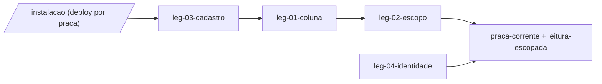

# Swimlane · praca

lane-meta: thread=no · risk=high · owner=plataforma

FORK: B (task-driven) - o backlog inteiro desce para Task-Specs assinados no Pass 5; nao ha caminho plan-driven neste programa.

Component **A · Praca** - transforma a instalacao em unidade de isolamento: toda pessoa e todo registro do fluxo v2 passam a pertencer a uma praca, e nenhuma leitura atravessa a fronteira.
Input contract: nenhum - esta raia e a base, nao consome nenhuma outra.
Output contract: **`praca-corrente`** - a praca da pessoa autenticada, e a garantia de que toda leitura ja vem escopada por ela no servidor.

> **PRD da raia - indice enxuto sobre os legs.** O detalhe de cada leg vive no
> arquivo dele (`leg-NN-<tech>.md`, chave `swimlane-praca-leg-NN`). Aqui so
> interface, costura, DAG e links.

## Seam

A costura fica **acima de tudo**: praca e a unica raia que nao consome nenhuma
outra, e todas as outras dependem dela. A interface publicada tem duas partes,
ambas nomeaveis:

1. **`praca-corrente`** - dada uma pessoa autenticada, qual praca e a dela.
2. **`leitura-escopada`** - a garantia de que uma consulta feita por essa pessoa
   nao devolve registro de outra praca, decidida no servidor.

A dependencia e de mao unica porque nenhuma raia a jusante devolve informacao
para ca: comissao, prestador, administracao e dados **leem** o escopo e nunca o
redefinem.

O segredo desta raia (o que mais tende a mudar e por isso fica escondido aqui):
**como** o escopo e imposto. Quem consome so precisa saber que veio escopado.

## Architecture



Step-by-step:

1. `leg-01` da a toda pessoa e a todo registro do fluxo v2 um dono: a praca.
2. `leg-02` troca a leitura global de pessoas por leitura escopada no servidor.
3. `leg-03` faz o cadastro publico herdar a praca da instalacao, sem escolha.
4. `leg-04` da rosto a praca; as demais raias consomem so o contrato acima.

## Non-Goals

- **Nao** decide se o subsistema de vagas da v1 tambem vira multi-praca - a v1
  segue com o vinculo dela (`workspace_members`), e a faxina e da raia `dados`.
- **Nao** cria papeis novos nem mexe em autorizacao por modulo: `guardModule()`
  ja resolve modulo, e praca e outra dimensao.
- **Nao** implementa transbordo entre pracas vizinhas - W-3 excluiu isso.
- **Nao** permite que a mesma pessoa exista em duas pracas.

### C1 - identidade e unica na plataforma inteira (objecao CRITICAL do Pass 4)

O adversario apontou que a decisao de isolar por praca **dentro de uma base
compartilhada** colide com a identidade: se o cadastro e unico por e-mail na
plataforma, uma pessoa nao pode ser cliente em Niteroi e prestador em Maceio.

A objecao procede, e a base **e** compartilhada por decisao: D-011 poe o SysAdmin
acima de todas as pracas, e ninguem enxerga varias pracas de uma vez se cada uma
tiver banco proprio. Logo, a consequencia e real e fica **declarada, nao
descoberta depois**:

> **Uma identidade pertence a exatamente uma praca.** Quem se cadastrar na
> instalacao de outra praca com o mesmo e-mail nao cria uma segunda conta - o
> sistema recusa e explica.

Isso e aceitavel para o produto de hoje (praca = cidade, e uma pessoa trabalha
onde mora) e **inaceitavel** no dia em que alguem se mudar de cidade. A saida
naquele dia e transferir a pessoa de praca, nao duplica-la - e transferencia nao
esta neste ciclo.

**Aberto para o dono:** confirmar que uma pessoa por praca serve por enquanto.
Se nao servir, a alternativa e identidade global com vinculo por praca, e isso
muda `leg-01` e `leg-03`.

## Legs — index (full detail in each file)

| Leg | Responsibility (one line) | File |
|---|---|---|
| **leg-01-coluna** | Dar dono de praca a pessoa e ao registro transacional, e adotar os orfaos que ja existem | [leg-01-coluna.md](leg-01-coluna.md) |
| **leg-02-escopo** | Trocar a leitura global de pessoas por leitura escopada, decidida no servidor | [leg-02-escopo.md](leg-02-escopo.md) |
| **leg-03-cadastro** | Fazer o cadastro publico herdar a praca da instalacao, sem o usuario escolher | [leg-03-cadastro.md](leg-03-cadastro.md) |
| **leg-04-identidade** | Dar a cada praca nome e rosto proprios nas superficies | [leg-04-identidade.md](leg-04-identidade.md) |

Stable keys: `swimlane-praca-leg-01..04` - o sufixo `<tech>` e rotulo trocavel.

## Dependencies

```
leg-01  ->  leg-02  ->  (praca-corrente + leitura-escopada)
leg-01  ->  leg-03
leg-01  ->  leg-04
```

## Build order

1. **leg-01** - nada mais desta raia existe sem dono de praca; e o insumo que
   destrava todo o resto do programa.
2. **leg-02** - o requisito de seguranca (R-3); vem antes de qualquer superficie
   nova, senao a superficie nasce vazando.
3. **leg-03** - fecha a porta de entrada: pessoa nova ja nasce com praca.
4. **leg-04** - cosmetico perto dos outros tres; prioridade `could`.

## Open questions

| # | Item | Owner | Blocks build? |
|---|---|---|---|
| Q1 | `workspaces.owner_id` codifica empresa (ADR 0003). Uma praca tem dono pessoa fisica? **Resolvido por mim (D-010):** nao — o campo passa a significar *administrador responsavel*. A coluna sobrevive, o significado muda. Reverter custa uma migration. | eu (decidido) | Nao mais |
| Q2 | Os 2 sysadmins tambem recebem praca? **Resolvido por mim (D-011):** nao — sysadmin e supra-praca por definicao (ROADMAP §2.1). O backfill cobre prestador e cliente. Reverter custa uma linha. | eu (decidido) | Nao mais |
| Q3 | De onde a instalacao sabe qual praca serve? **Resolvido por mim (D-012):** variavel de ambiente por deploy. `leg-03` isola a resolucao num ponto so, entao trocar a fonte e barato. | eu (decidido) | Nao mais |

> As tres foram decididas por mim em 09/09/2026 a pedido do dono, que pediu para
> eu seguir sem esperar. Cada uma esta em `cvg/docs/tech-spec/_decisoes-travadas.md`
> com o porque e o custo de reverter — e o lugar de auditar.

## Spec traceability

- **R-1, R-5** - `leg-01` da dono a toda pessoa e adota os 7 orfaos medidos no ADR 0001.
- **R-2, R-3** - `leg-02` substitui a politica irrestrita registrada no ADR 0002.
- **R-4** - `leg-03` faz a instalacao decidir a praca (D-007).
- **R-32** - `leg-04`.
- **ADR 0001** - tenancy tratada como ausente, nao como existente-e-despovoada.
- **ADR 0002** - a fronteira e a politica de leitura, nao o filtro na consulta.
- **ADR 0003** - "praca" e termo novo ocupando estrutura velha; o glossario manda.
