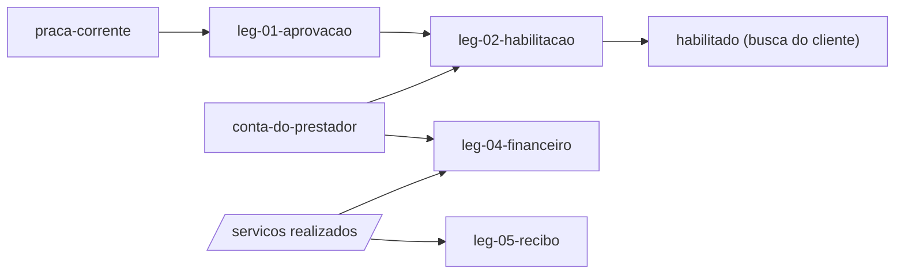

# Swimlane · prestador

lane-meta: thread=no · risk=med · owner=produto

Component **B · Prestador** - tudo que e do prestador: o ciclo de vida do cadastro dele, o predicado que decide se ele aparece numa busca, e as superficies onde ele ve o proprio dinheiro.
Input contract: `praca-corrente` (raia praca) + `conta-do-prestador` (raia comissao).
Output contract: **`habilitado`** - o predicado unico que a busca do cliente consome para decidir se um prestador aparece.

> **PRD da raia - indice enxuto sobre os legs.** Detalhe no arquivo de cada leg
> (`leg-NN-<tech>.md`, chave `swimlane-prestador-leg-NN`).

## Seam

A costura publica **um predicado**: `habilitado`. Ele combina duas causas de
naturezas diferentes - aprovacao (decisao do Administrador) e adimplencia (estado
vindo da raia comissao) - e as esconde atras de uma pergunta so.

Esse e o ponto do corte: **a busca nao deve saber por que um prestador nao
aparece.** Se ela precisasse distinguir "nao aprovado" de "suspenso por divida",
estaria acoplada a duas raias em vez de a um contrato.

Mao unica: esta raia **le** `conta-do-prestador` e nunca escreve nele. A raia
`comissao` nao le `habilitado` - se lesse, haveria ciclo. **Quebra de ciclo (H5):
inversao de dependencia** - as duas raias dependem do contrato extraido
`conta-do-prestador`, e nao uma da outra.

## Architecture



Step-by-step:

1. `leg-01` da ao cadastro do prestador um estado de aprovacao com dono e data.
2. `leg-02` funde aprovacao e adimplencia no predicado unico que a busca consome.
3. `leg-03` deixa o perfil mostrar mais de uma foto.
4. `leg-04` mostra ao prestador o que entrou e o que saiu de comissao.
5. `leg-05` emite o recibo do servico.

## Non-Goals

- **Nao** define aliquota nem calcula divida - isso e da raia `comissao`.
- **Nao** aprova por Telegram (W-1): a aprovacao acontece pelo site.
- **Nao** decide o que acontece com servico ja agendado de um prestador suspenso
  - essa regra pertence a `swimlane-comissao-leg-06`.

## Legs — index (full detail in each file)

| Leg | Responsibility (one line) | File |
|---|---|---|
| **leg-01-aprovacao** | Dar ao cadastro do prestador um estado de aprovacao, com quem aprovou e quando | [leg-01-aprovacao.md](leg-01-aprovacao.md) |
| **leg-02-habilitacao** | Fundir aprovacao e adimplencia no predicado unico que a busca consome | [leg-02-habilitacao.md](leg-02-habilitacao.md) |
| **leg-03-galeria** | Deixar o perfil mostrar mais de uma foto, sem secao vazia | [leg-03-galeria.md](leg-03-galeria.md) |
| **leg-04-financeiro** | Mostrar ao prestador o que faturou e o que pagou de comissao por periodo | [leg-04-financeiro.md](leg-04-financeiro.md) |
| **leg-05-recibo** | Emitir o recibo de um servico realizado, com ou sem assinatura | [leg-05-recibo.md](leg-05-recibo.md) |

Stable keys: `swimlane-prestador-leg-01..05`.

## Dependencies

```
praca-corrente      -> leg-01 -> leg-02 -> habilitado
conta-do-prestador  -> leg-02
conta-do-prestador  -> leg-04
servicos realizados -> leg-04, leg-05
praca-corrente      -> leg-03
```

## Build order

1. **leg-01** - sem estado de aprovacao nao ha o que fundir.
2. **leg-02** - publica o contrato; a busca passa a depender dele.
3. **leg-05** - recibo e independente e util cedo.
4. **leg-04** - financeiro consome comissao ja paga, entao vem depois de
   `swimlane-comissao-leg-05`.
5. **leg-03** - `could`; ultimo.

## Open questions

| # | Item | Owner | Blocks build? |
|---|---|---|---|
| Q1 | Os prestadores que ja existem entram como aprovados ou pendentes? Assumido **aprovados** - eles ja operam, e vira-los para pendente derrubaria servicos em andamento. | eu (decidido) | Nao |
| Q2 | GAP-003 do spec: texto exato do aviso de preco variavel. | Leonardo Chalhoub | Nao - o perfil funciona sem ele |

## Spec traceability

- **R-21, R-22** - `leg-01` e `leg-02`.
- **R-31** - `leg-03`.
- **R-24** - `leg-04`.
- **R-23** - `leg-05`.
- **ADR 0005** - o recibo e o financeiro usam o valor final, nao o proposto.

## Seam evolution (H4) - o contrato que esta raia consome

Esta raia consome **`conta-do-prestador`** (raia comissao). Mudancas **aditivas**
naquele contrato - um estado novo alem de em-dia/pendente/suspensa, um campo a
mais - sao seguras: `leg-02` trata estado desconhecido como nao-habilitado, que e
o lado seguro.

Mudancas **quebradoras** - renomear um estado, remover `suspensa`, tornar
obrigatorio um campo que hoje nao existe - exigem janela de convivencia: a raia
comissao publica o novo e o antigo ao mesmo tempo ate esta raia migrar.

Recomendacao: a raia `comissao` mantem verde um teste de contrato dirigido pelo
consumidor, afirmando que `conta-do-prestador` sempre responde um dos estados
conhecidos - de modo que uma mudanca la nao quebre a busca daqui em silencio.
